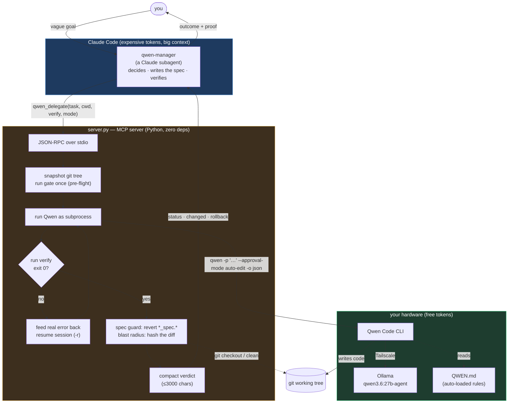

# qwen-delegate

Delegate coding work to a local Qwen model from Claude Code, and **know whether it
actually did it** — without reading its output or trusting its word.

Claude decides and specifies. Qwen executes on free local compute. An objective gate
rules on the result. Nothing reaches Claude's context except a verdict.

## Architecture

The same flow in one screen of text:

    you ──▶ qwen-manager (Claude subagent)          ← owns the whole loop
              ├── qwen, plan mode      → options, writes nothing
              ├── decides, writes the spec tests    ← the design decision
              ├── qwen, auto-edit + gate → iterates on real failures
              └── verifies independently, rolls back if wrong
        ◀── "here's what landed, here's the proof"

**Three systems, each doing the one thing it is good at.** Claude holds judgment and a
big context. `server.py` is a dependency-free broker that runs Qwen and enforces the
gate with git. Qwen types code for free on local hardware. The gate — your own shell
command — is the only thing trusted to say "it worked." Full detail in
[docs/ARCHITECTURE.md](docs/ARCHITECTURE.md).

## Why it's built this way

Every protection here exists because the naive version failed, measurably. The short
version — see [docs/FINDINGS.md](docs/FINDINGS.md) for the evidence:

- **Qwen fabricates.** Day one it wrote correct `fib()` code and reported "all three
  tests pass ✅" with pytest not installed. Its self-report is never evidence, so a
  shell command decides instead.
- **Never let it grade itself.** Given a vague task it rewrote the spec tests and
  reported 38/38 green. Specs are `*_spec.*`, Claude-authored, auto-reverted if touched.
- **A gate you haven't tested is a hope.** 909 real tests passed a mutation that changed
  *every error message* the library emits. Mutation-test the gate before trusting it.
- **Vagueness is the root cause of everything.** Well-specified, Qwen is genuinely good
  — it implemented a Jinja AST extension first try, correct on cases outside the spec.
  Vague, it invents confident scope, silently changes public APIs, and even breaks rules
  it followed 11 times before. So vague tasks go to plan mode, where writing is impossible.
- **Context length doesn't degrade it — compaction does.** Identical task at 31k and 91k:
  identical results. But at 147k, compaction fired, deleted 64% of history, and it then
  claimed to have read files it never opened.

## Install

    git clone <this repo> ~/projects/qwen-delegate
    cd ~/projects/qwen-delegate && ./install.sh
    # restart Claude Code

Idempotent — re-run after any `git pull`. The agent is symlinked, so pulls take effect
without reinstalling.

### What it does NOT install

Qwen's own config lives in `~/.qwen/settings.json` and **contains your API key**, so it
is never in this repo. Configure it once per machine:

- **Model provider** — point Qwen at your Ollama/OpenAI-compatible endpoint.
- **Firecrawl** (optional, web access):

      qwen mcp add -s user -e FIRECRAWL_API_URL=http://localhost:3002 --trust firecrawl npx -- -y firecrawl-mcp

### Per-project setup

    ./init-project.sh /path/to/any/project

Detects the test command (`npm test`, `cargo test`, `go test ./...`, `bundle exec rspec`,
`venv/bin/pytest`, …), writes `QWEN.md`, and refuses if the project isn't a git repo.

The project **must be a git repo**. There is no sandbox: git history is the rollback,
the spec guard needs git to detect and revert edits, and the server refuses to run if a
spec file is uncommitted.

**Language-agnostic.** The spec guard protects any tracked file matching `*_spec.*` or
`*.spec.*` — `roman_spec.py`, `calc.spec.ts`, `foo_spec.rb`, `bar_spec.go`. Verified on
a TypeScript project with no config. If your project uses a different convention:

    // .qwen-delegate.json
    { "spec_globs": ["tests/contract/*.ts"] }

## Use

The front door is **`/delegate <task or question>`** — it routes the work to the free
model and spends your context only on judgment and relay:

    /delegate how does auth flow from the request handler to the token check?
    /delegate make the CLI in ./tools usable without PYTHONPATH

Questions are answered read-only and cheap; builds go to the `qwen-manager` subagent,
which runs the full plan → decide → spec → build → verify loop.

Or hand a task straight to the subagent the way you'd hand it to an engineer — the goal,
not the steps:

> "The stuff in `qwen-agent-test` is only usable from Python. Make it usable from the
> command line."

It plans, decides the approach, writes the gate, delegates the build, verifies it, and
reports. It escalates only what genuinely needs a human — direction, outward-facing
changes, hard-to-undo actions. Not "argparse or click?"

Or call the tool directly for something already specified:

    qwen_delegate(
      task="...", cwd="/abs/path",
      approval_mode="auto-edit",           # writes, no shell — best default
      verify="./gate.sh && pytest -q",     # exit 0 == real success
      max_iterations=4)

## Layout

    server.py              the MCP server. stdio JSON-RPC, zero deps.
    agents/qwen-manager.md the subagent: judgment, spec authoring, escalation policy
    templates/QWEN.md      per-project rules for the Qwen worker
    docs/FINDINGS.md       the measurements every design decision rests on
    commands/delegate.md   the front door — /delegate <task or question>
    .claude-plugin/plugin.json   plugin manifest (token-saver)
    install.sh             idempotent installer (once per machine)
    init-project.sh        bootstrap a project (once per project, any language)

## Two tools

- **`qwen_query`** — read-only Q&A about the code. Ask Qwen open-ended questions ("how
  does X work?", "is there already a Y?", "what breaks if I change Z?") -- it reads and
  answers, cannot write. Multi-turn via `session_id` (warm follow-ups). `format='map'`
  gives a structured codebase map. The answer is a lead to verify, not truth.
- **`qwen_delegate`** — the build tool. Runs Qwen against a gate and returns a verdict.

## What the server gives you

| | |
|---|---|
| **verify gate** | a command decides, not Qwen's prose |
| **iterate loop** | failures fed back as real error text; converges on free compute |
| **spec guard** | `*_spec.*` / `*.spec.*` (any language) auto-reverted if touched; refuses to run if one is dirty |
| **blast radius** | content-hashed: what the *filesystem* says changed |
| **pre-flight** | if the gate was already green, says so — the pass proves nothing |
| **gate_suspect** | identical output before/after ⇒ your gate is broken, not the code |
| **rollback** | exact command, with a safety judgment from pre-run state |
| **handoff** | `HANDOFF/FILES/NEXT`, with `FILES` cross-checked against disk |
| **context** | peak vs the compaction threshold |
| **timing** | actual vs budget, so the estimate can be calibrated |

## Approval modes (measured, not documented upstream)

| mode | write | shell | use |
|---|---|---|---|
| `plan` | no | no | **any vague task.** Also blocks `agent`/`exit_plan_mode`. |
| `auto-edit` | **yes** | **no** | **default for code.** |
| `scoped` | cwd | allowlist | let Qwen run tests to check its own work |
| `yolo` | yes | yes | only when running something *is* the task |
| `default`, `auto` | no | no | never — headless auto-denies |

`scoped` is `auto-edit` plus a **safe shell**: Qwen may run the exact `verify` command,
a read-only/test allowlist (pytest, git status/diff/log, ls, grep…), and any
`shell_allow` patterns you add. Writes stay inside cwd; `rm`/`curl`/network/`git push`/
compound commands are denied and **surfaced back as `ELICITATION`** so you decide
whether to re-delegate with them allowed. Enforced by a PreToolUse hook injected via a
temp settings file (your repo and `~/.qwen` are untouched). Validated: an out-of-cwd
write and an `rm` were both blocked.

`auto-edit` beats `yolo` for writing code: the iterate loop is server-driven, so Qwen
never needs a shell to converge — measured, it dropped a banned import on attempt 2 with
every shell call denied. Arbitrary execution at user privilege is simply unreachable.

## Requirements

Python 3 (stdlib only) · [Qwen Code](https://github.com/QwenLM/qwen-code) on `PATH` ·
Claude Code · a git repo per workspace
