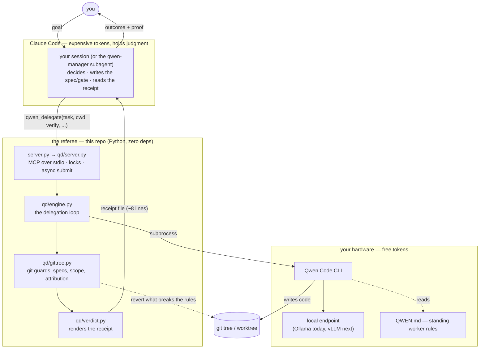
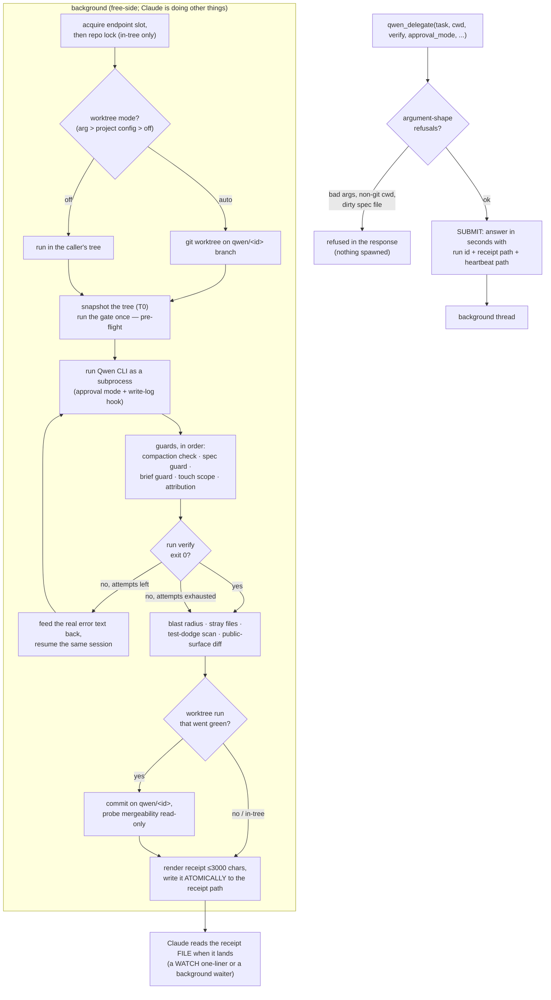
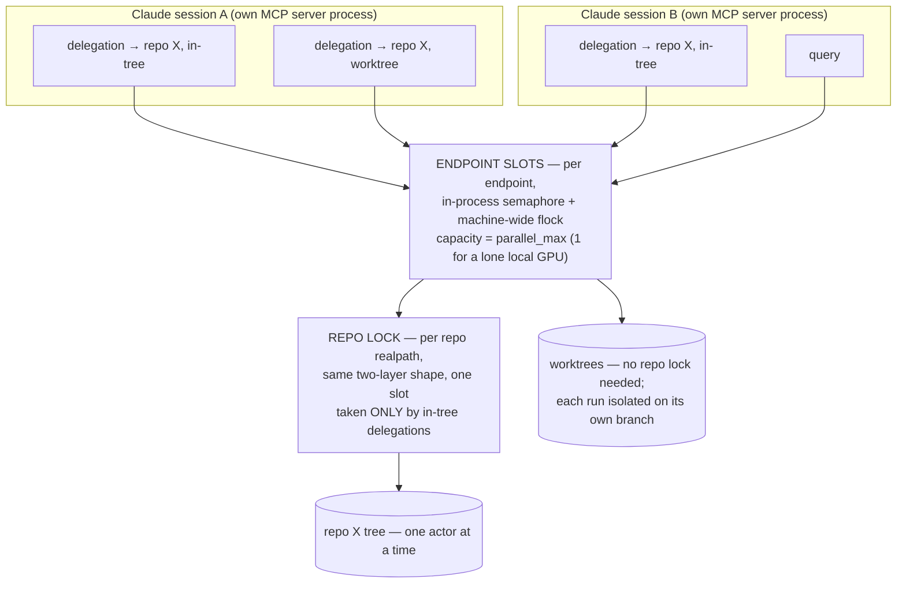

# TECH_README — how this repo works, from zero

This is the orientation document: what the system is, how a delegation actually
flows through it, and the concepts you need before touching anything. It links
to the deeper docs rather than replacing them.

> **One sentence:** Claude (expensive, smart, big context) writes the *spec* and
> the *test*; Qwen (free, local, tireless) writes the *code*; a small Python
> referee runs Qwen against the test and reports back a short receipt — so the
> expensive model spends its tokens on judgment, never on typing or reading.

The project is also called **token-saver** (its plugin name). Measured effect:
the same work for 18–69% fewer Claude tokens at equal quality, with the saving
growing with how much *reading* the task would have forced.

---

## 1. The cast, in one diagram



Three parties, each doing the one thing it's good at:

| party | holds | never does |
|---|---|---|
| **Claude** | judgment, design, the definition of "correct" | reads the diff, re-runs a green gate, types mechanical code |
| **the referee** (this repo) | process launching, git bookkeeping, lock discipline | judgment — it has no model, no opinions, ~98% of wall clock is inference it merely waits on |
| **Qwen** | typing, iterating, reading the codebase | grading its own work (unless the trust dial says so, explicitly) |

**The load-bearing rule: the worker's self-report is never evidence.** Not
because the worker is an adversary — because a report is not a measurement.
The `verify` command (the **gate**) is the only thing trusted to say "it
worked": a shell command that exits 0 only on true success. Everything else in
this repo exists to make that rule hold under real conditions.

---

## 2. Life of a delegation

What actually happens when Claude calls `qwen_delegate`:



Key properties of this flow:

- **Async by default (0.5.0).** The tool call returns in seconds; the minutes of
  inference happen on a background thread. `wait: true` restores the blocking
  call. A heartbeat file (`progress.json`) answers "is it hung?" as a file read.
- **The iterate loop is server-driven.** The gate's real stderr/stdout goes back
  to the worker as the next prompt. The worker never needs a shell to converge —
  which is why `auto-edit` (writes yes, shell no) is the default mode.
- **Every path ends in a receipt**, including crashes — the caller was handed a
  path to poll, and a run that dies silently would poll forever.
- **The receipt is written atomically** (temp + rename): the file *existing*
  means the run is *complete*.

---

## 3. The major concepts

### The gate (`verify`)

A shell command that defines success. The server runs it — pre-flight once
(before the worker), then after every attempt. Corollaries the repo enforces:

- **Pre-flight**: if the gate is already green before the worker ran, a later
  pass proves nothing; the receipt says so (`preflight_expect: "red"` refuses
  such a run outright for greenfield work).
- **`gate_suspect`**: identical gate output before and after the run means your
  gate is broken, not the code.
- **Mutation-test your gates**: a green gate that passes mutated code is a hope,
  not a check (see `docs/FINDINGS.md` for the measured case: 909 real tests
  passed a mutation that changed every error message).

### The trust dial (`trust`)

Who authors the gate, chosen per task:

- **`verified`** — you (Claude) write the gate. For anything correctness-critical,
  irreversible, or outward-facing.
- **`self`** (default) — the worker's own test suite is the gate, behind a
  non-vacuous guard (`min_tests` floor). Maximum token saving; the receipt
  stamps `TRUST: self` so a green is never misread as independent verification.
- **`auto`** (as a standing config default) — the server *refuses* a bare call,
  forcing the criticality decision on every delegation.

### Approval modes

What the worker may do, probed and measured (upstream docs don't cover this):

| mode | write | shell | when |
|---|---|---|---|
| `plan` | no | no | any vague task — options come back, nothing can be written |
| `auto-edit` | yes | no | **the default for code** |
| `scoped` | cwd only | allowlist | worker runs its own tests; blocked commands surface as approval requests |
| `yolo` | yes | yes | only when running something *is* the task |

### Protected specs and the brief

Files matching `spec_globs` (`*_spec.*`, `specs/*`, and — in this repo — the
server files themselves) are the definition of correct. The worker editing one
is auto-reverted and the attempt retried with an explanation. Same for the
**brief** (`brief_file` — a playbook document in the repo that *is* the task):
the worker does the work the document describes; it doesn't get to rewrite the
document.

### C10 co-work attribution — why other agents can share the tree

In `scoped` mode and hook-observed `auto-edit` (the default), a PreToolUse hook
logs every path the worker writes. That gives every guard an attribution test
*before it acts*: a changed file **with no logged worker write is somebody
else's work** — a human, a Claude subagent, another tool — and is **reported,
never reverted** (`SCOPE: … caller co-work?`, `SPEC CHANGED (unattributed)`).
Rolling back a caller's concurrent edit is the one sin the guards are built to
avoid. Plain `yolo` has no write log, so there the old rule stands: one writer
per tree.

### Worktree isolation — the norm when co-work is expected

`worktree: "auto"` gives the run its own git worktree on a `qwen/<id>` branch;
the receipt carries the exact `MERGE:` command, and mergeability is probed
read-only (`git merge-tree`) before anyone touches your tree. Since co-work is
the normal case, this can be (and in this repo, is) the **standing project
default**: `"worktree": "auto"` in `.qwen-delegate.json`, resolved by one
function (`engine.worktree_mode`: call arg > project config > off) that the
engine, the receipt logic, and the server's lock decision all consult. The one
cost to know: **a worktree branches from HEAD** — it is blind to uncommitted
co-work, so *commit first* is load-bearing.

### Compaction — the honesty boundary

Context-window compaction is the documented fabrication trigger: after one, the
worker's account of its own work is unreliable (measured: post-compaction it
claimed to have read files it never opened). Default policy is **`refuse`** —
the run stops the moment a compaction fires, nothing from it is graded, and the
receipt hands the call back. The fix is structural (split the task), not a retry.

### The receipt

The only thing that re-enters Claude's context (≤3,000 chars). `STATUS` decides;
the deterministic lines catch what a green gate can't: `CHANGED` (filesystem
truth, content-hashed), `NEW PUBLIC SURFACE` (scope creep), `TEST DODGE` (a
skip added to delivered tests), `STRAYS` (created files the task never named),
`SCOPE` (co-work attribution), `MERGE`, `CONTEXT` (peak vs compaction
threshold), `COST`, `ROLLBACK` (exact command + safety judgment), `LEDGER`
(tokens burned vs returned). On green, Claude does **not** read the code — the
gate already proved it.

### Queries (`qwen_query`)

The read-only sibling: open-ended questions about a codebase, answered on free
tokens, synchronous (the answer *is* the deliverable). Structure and semantics
are reliable; precise line-number citations are not — answers are leads to
verify, not truth. `result_schema` turns an answer into a validated JSON value.

### Playbooks

A recurring brief lives in the repo as markdown, sent by name (`brief_file`),
versioned by git. Front matter supplies gate/scope/timeouts where the call is
silent; `{{slot}}`s fill from `vars` (mismatches refused by name);
`chain: true` compiles `## Step <n>` sections into a dependent chain.
`amend_brief` folds a correction into the document as a dated amendment — the
next reader inherits it.

### The run log

Every call appends one JSONL record under `<project>/.qwen-delegate/` (a
self-gitignoring directory — the server diffs the tree to attribute changes, so
its own files must never look like the worker's). Measured leverage to date:
**324×** free tokens burned per token returned to Claude's context.

---

## 4. Concurrency — many agents, one machine

Built and CI-gated for the real setup: multiple Qwen delegations *and* multiple
Claude agents touching one project, from multiple sessions.



The three rules:

1. **Endpoint slots** gate every executor-invoking call (delegations *and*
   queries). The scarce resource is the GPU; capacity is declared per endpoint
   (`parallel_max` in `~/.qwen-delegate/executors.json`) and honoured only when
   `dispatch: "parallel"` is set — any other value, including a typo, reads as
   serial. Both halves (semaphore + flock file under `~/.qwen-delegate/locks`)
   are held for the whole handler, so two sessions pointed at one box queue
   instead of colliding.
2. **The repo lock** serializes in-tree delegations into one repo — "one actor
   per tree" — machine-wide, across sessions, even when they arrive through
   *different* endpoints. Worktree runs skip it by construction.
3. **A submit takes no locks.** Guards are acquired inside the background
   thread, so submitting never blocks on a busy GPU — the queue is real, it
   just doesn't run down the caller's clock.

Deadlock-freedom is structural: everything acquires **endpoint first, then
repo**, in one place (`_guards_for`). The load-robust serialization claims are
CI-enforced by `specs/serialize_spec.py`; the wall-clock *overlap* claims live
in `specs/dispatch_spec.py` (excluded from CI — a loaded box can fail them
honestly).

**Swapping the executor is config, not code**: an `executors.json` profile
(argv template + `settings_overlay` for sampling params), an endpoint entry
with a real `parallel_max`, and `dispatch: "parallel"`. That's the vLLM path.

---

## 5. Module map

```
server.py                two-line shim → qd/server.py (what .mcp.json runs)
qd/
  server.py              MCP dispatch: threads, write lock, endpoint slots,
                         repo locks, async submit, batch/chain fan-out
  engine.py              THE delegation loop: preconditions, worktree acquire,
                         attempt loop, guards, trust dial, retry feedback
  invoke.py              subprocess runner: pipe draining, stall detection,
                         streaming, compaction bookkeeping
  gittree.py             git truth: snapshots, spec guard, restore/revert,
                         public-surface diff, test-dodge scan, config readers
  verdict.py             receipt rendering (every deterministic line)
  worktrees.py           isolated worktree acquire/release, merge classification
  profiles.py            executor profiles + dispatch policy resolution
  queries.py             qwen_query (read-only path; format='answer'|'map')
  playbook.py            brief documents: front matter, slots, chain compile
  jsonschema.py          result_schema validation (subset, path-wise feedback)
  limits.py, limits_qwen.py   burn budget, stall/decode limits
  runlog.py              runs.jsonl writer + in-flight detection (pid-based)
  graph.py               graphify integration (optional code graph, worker-side)
  refs.py                pinned web references
  bootstrap.py           first-run setup: QWEN.md, test-command detection
  doctor.py              machine diagnostics (/doctor)
  schemas.py             MCP tool schemas (the caller-facing contract)
  setup.py               managed CLAUDE.md block updater (version-stamped)
scoped_hook.py           PreToolUse allowlist + C10 write log (scoped/auto-edit)
compact_hook.py          PreCompact/PostCompact markers (the honesty boundary)
specs/                   the repo's own gate suite — one spec file per module;
                         Claude-authored, never delegated, mutation-tested
agents/                  qwen-manager (isolation container) · architect (L5 loop)
skills/                  delegation (THE discipline, canonical) · architect ·
                         lld-principles · graphify-setup
commands/                /offload · /doctor
templates/               QWEN.md worker rules · CLAUDE-snippet.md policy block
docs/                    USAGE (day-to-day) · HLD/LLD (design) · FINDINGS
                         (measured evidence) · PENDING (open items) · PRINCIPLES
context/                 agent-facing reference: SYSTEM.md · TESTING.md
```

Two meta-rules that surprise newcomers:

- **The repo gates itself.** `specs/*_spec.py` is the same spec-guard mechanism
  the plugin enforces on other projects, applied to its own code — and the
  server/hook files are in this repo's `spec_globs`, so no delegation may ever
  edit them. Concurrency code is hand-written by policy: races are where green
  gates under-prove.
- **Docs are load-bearing.** `skills/delegation/SKILL.md` is not documentation
  *about* the system — it's the instruction set Claude loads before using it.
  The `CLAUDE-snippet.md` managed block is how new capabilities reach sessions
  that would otherwise never hear of them.

---

## 6. Where to go deeper

| question | read |
|---|---|
| how do I use it day-to-day? | `docs/USAGE.md` |
| why is it built this way? | `docs/PRINCIPLES.md`, then `docs/FINDINGS.md` (the measured failures behind every guard) |
| cross-module contracts | `docs/HLD.md` §5 (pinned once, referenced everywhere) |
| per-module design | `docs/LLD.md` |
| what's unfinished / parked | `docs/PENDING.md` |
| the discipline Claude follows | `skills/delegation/SKILL.md` |
| what changed when | `CHANGELOG.md`, `docs/CHANGELOG.md` |

The fastest way to *feel* the system: run one delegation with a real gate and
read the receipt file it lands —

```
qwen_delegate(
  task="add a --version flag to cli.py printing the version from pyproject.toml",
  cwd="/abs/path/to/repo",
  verify="./cli.py --version | grep -q '[0-9]'",
  approval_mode="auto-edit")
```

— then open `.qwen-delegate/receipts/<id>.md` and match each line against
§3's "The receipt".
