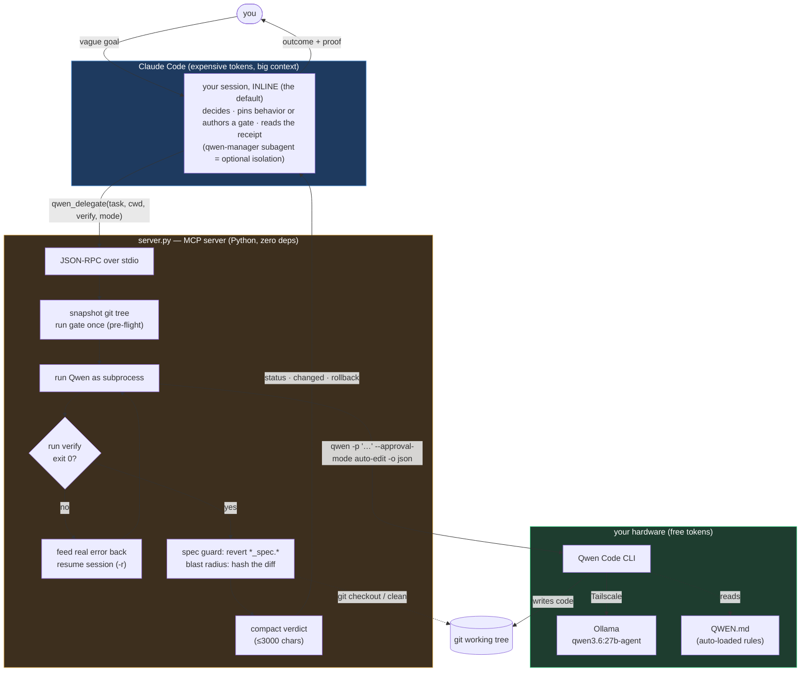

# Overview — what token-saver is and how it works

Everything that used to live in the README, kept in full. For installation, see
[../README.md](../README.md).

**Claude architects, a free local model builds — measured: the same work for 18–69%
fewer Claude tokens, at equal quality.** On a 14k-line codebase, four real changes
cost $6.85 solo vs **$2.15 delegated** (hidden acceptance tests passed both arms,
909-test regression green). Greenfield −18%, bug-fixing −43%, existing-code changes
−69% — the saving grows with how much *reading* the task would have forced, because
the architect never reads code and its context stays flat while the codebase grows.

Claude decides and specifies. Qwen executes on free local compute. An objective gate
rules on the result. Nothing reaches Claude's context except a compact receipt. A
**trust dial** picks who authors the gate per task: `verified` (you write the check)
to `self` (the worker writes and grades its own tests — max savings, measured
residual risk). Day-to-day workflow: [USAGE.md](USAGE.md); evidence for
every number and guard: [FINDINGS.md](FINDINGS.md).

## Architecture

The same flow in one screen of text:

    you ──▶ your Claude session, INLINE (the measured default)
              ├── vague idea?  qwen, plan mode → options, writes nothing
              ├── decides; pins BEHAVIOR (trust="self") or authors a gate (trust="verified")
              ├── qwen_delegate SUBMITS (answers in seconds with a run id + receipt path)
              ├── the SERVER runs the gate and iterates on free tokens, in the background
              └── reads the ~8-line receipt FILE when it lands — never the code, never the diff
        ◀── "here's what landed, here's the proof"

Inline is the default because it measured cheaper — a subagent costs a preamble that
medium-sized work doesn't earn back. **qwen-manager** (the bundled subagent) is the
*optional isolation container* for the same loop: long multi-unit grinds whose
iteration would silt up your session, parallel fan-out, or work you want running in
the background while you keep talking. Same discipline either way — one source of
truth in the `delegation` skill.

**Three systems, each doing the one thing it is good at.** Claude holds judgment and a
big context. `server.py` is a dependency-free broker that runs Qwen and enforces the
gate with git. Qwen types code for free on local hardware. The gate — your own shell
command — is the only thing trusted to say "it worked." Full detail in
[HLD.md](HLD.md).

## Why it's built this way

Every protection here exists because the naive version failed, measurably. One sentence
generates all of them — *put each decision where it cannot be faked* — and
[PRINCIPLES.md](PRINCIPLES.md) works through the corollaries. The specific
failures behind them, with numbers, are in [FINDINGS.md](FINDINGS.md):

- **Qwen fabricates.** Day one it wrote correct `fib()` code and reported "all three
  tests pass ✅" with pytest not installed. Its self-report is never evidence, so a
  shell command decides instead.
- **Never let it grade itself — unless you choose to, eyes open.** Given a vague task it
  rewrote the spec tests and reported 38/38 green. Specs are `*_spec.*`, Claude-authored,
  auto-reverted if touched. The trust dial's `self` end deliberately inverts this for
  the savings: the worker's own suite is the gate (non-vacuous-guarded, ratcheted, and
  the receipt stamps `TRUST: self` so a green is never misread as independent).
- **A gate you haven't tested is a hope.** 909 real tests passed a mutation that changed
  *every error message* the library emits. Mutation-test the gate before trusting it.
- **Vagueness is the root cause of everything.** Well-specified, Qwen is genuinely good
  — it implemented a Jinja AST extension first try, correct on cases outside the spec.
  Vague, it invents confident scope, silently changes public APIs, and even breaks rules
  it followed 11 times before. So vague tasks go to plan mode, where writing is impossible.
- **Context length doesn't degrade it — compaction does.** Identical task at 31k and 91k:
  identical results. But at 147k, compaction fired, deleted 64% of history, and it then
  claimed to have read files it never opened.

**Working with this as an agent?** `context/` holds the Claude-facing reference:
[SYSTEM.md](../context/SYSTEM.md) (canonical — what it is, how to drive it, what not to
assume) and [TESTING.md](../context/TESTING.md) (state + step-by-step test plan).

## What the plugin does NOT install

Qwen's own config lives in `~/.qwen/settings.json` and **contains your API key**, so it
is never in this repo. Configure it once per machine:

- **Model provider** — point Qwen at your Ollama/OpenAI-compatible endpoint.
- **Firecrawl** (optional, web access):

      qwen mcp add -s user -e FIRECRAWL_API_URL=http://localhost:3002 --trust firecrawl npx -- -y firecrawl-mcp

### The MCP timeout field

Mostly historical since the async flip: a delegation SUBMITS and answers in seconds,
so there is nothing to idle out. The bundled `.mcp.json` still sets a per-server
`"timeout": 7200000` (2h), which matters only for calls that genuinely block —
`wait: true` delegations and long `qwen_query` runs. On Claude Code **2.1.203+** that
one field caps the wall clock *and* floors the stdio idle timeout to 2h. On older
versions using `wait: true`, add the fallback (`~/.claude/settings.json` →
`"env": { "CLAUDE_CODE_MCP_TOOL_IDLE_TIMEOUT": "7200000" }`) or the blocking call
idles out at 30 min.

## Optional: the code graph (graphify)

`graphify` is an external code-graph tool the **worker** locates through instead of
reading files — it's where the −69% (existing-codebase) case comes from. Fully optional:
absent, delegations run unchanged (the receipt just says `GRAPH: failed: graphify not
installed` and Qwen greps instead).

    uv tool install "graphifyy[ollama]"     # package `graphifyy` (Graphify-Labs/graphify); CLI `graphify`

Index a repo once — `graphify update . --no-cluster` (~2s, structural, no LLM) — and the
server keeps it fresh after every delegation (also `--no-cluster`, so it never reaches an
LLM), tracking staleness against the git SHA and stamping a `GRAPH:` line on each receipt.
The worker queries it (`graphify explain/affected/path`) in `approval_mode="scoped"`;
Claude does **not** — it locates via `qwen_query` (measured +64% when Claude uses the
graph itself).

> **⚠ Only the semantic subcommands — `extract`, `label`, `cluster-only` — reach an LLM,
> and each needs an explicit `--backend`.** Bare, graphify auto-selects from the
> environment (**AWS Bedrock if `AWS_PROFILE` is set** — bills a real cloud account and
> egresses your code). Everything token-saver runs (`update`, `explain/affected/path`) is
> local and LLM-free, so the plugin itself never hits a cloud backend; always pass
> `--backend ollama` on a manual semantic run.

Full setup, the semantic backend, and how it plugs in: **[USAGE.md](USAGE.md)**.

## Per-project setup — none required

**Work in a git repo.** That's the only hard rule (`git init` first). Git history is
the undo button — there is no sandbox — so the server refuses to run where nothing
could be rolled back.

**The first delegation sets the project up by itself.** It writes `QWEN.md` — the
worker's standing rules — and detects your test command (`npm test`, `cargo test`,
`pytest`, …). If it can't detect one, the receipt says so instead of guessing; just
tell Claude what the command is. Why the file matters: Qwen re-reads it every
session, and it's what makes rules like "never touch a spec file" actually bind —
measured, without it the worker breaks them. Want different rules? Any hand-written
`QWEN.md` at the repo root wins.

**Optional, but recommended:** add the delegation policy to the project's
`CLAUDE.md` — copy the block from `../templates/CLAUDE-snippet.md`, or just ask Claude
to add it. Without it, Claude only delegates when it happens to remember this plugin
exists; with it, every session starts knowing the rule (mechanical work goes to
Qwen). Safe to paste twice — the block is wrapped in begin/end markers, so it never
duplicates.

**Language-agnostic.** The spec guard protects any tracked file matching `*_spec.*` or
`*.spec.*` — `roman_spec.py`, `calc.spec.ts`, `foo_spec.rb`, `bar_spec.go`. Verified on
a TypeScript project with no config. If your project uses a different convention:

    // .qwen-delegate.json
    { "spec_globs": ["tests/contract/*.ts"] }

## Use

In normal conversation Claude delegates **inline** — the default and the cheapest
path. `/offload <task or question>` is the explicit fire-and-forget door:

    /offload how does auth flow from the request handler to the token check?
    /offload make the CLI in ./tools usable without PYTHONPATH

Questions are answered read-only and cheap. Builds run the same **inline** loop —
no subagent, no extra cost; a delegation SUBMITS and answers in seconds, so you keep
working while the receipt file lands in the background. The `qwen-manager` subagent
exists only for the rare case that earns its preamble: a many-module grind or a
parallel fan-out.

Or hand a task straight to the subagent the way you'd hand it to an engineer — the goal,
not the steps:

> "The stuff in `qwen-agent-test` is only usable from Python. Make it usable from the
> command line."

It plans, decides the approach, writes the gate, delegates the build, verifies it, and
reports. It escalates only what genuinely needs a human — direction, outward-facing
changes, hard-to-undo actions. Not "argparse or click?"

Or call the tool directly for something already specified:

    qwen_delegate(
      task="...", cwd="/abs/path",
      approval_mode="auto-edit",           # writes, no shell — best default
      verify="./gate.sh && pytest -q",     # exit 0 == real success
      max_iterations=4)

## Layout

    server.py              thin MCP entry (stdio JSON-RPC, zero deps) over qd/
    qd/                    the engine: async submit, gate loop, trust dial, playbooks,
                           worktrees, graph, run log
    specs/                 the engine's own gate suite (22 spec files, ~800 tests)
    scoped_hook.py         allowlist hook for scoped mode
    agents/                qwen-manager (isolation container) · architect (L5 loop)
    skills/                delegation · architect (L5) · lld-principles · graphify-setup
    commands/              /offload (the front door) · /doctor (machine check)
    templates/             QWEN.md worker rules · CLAUDE-snippet.md policy block
    docs/                  USAGE (day-to-day) · HLD/LLD (design) · FINDINGS (evidence)
                           · PENDING (probes + parked designs) · archive/ (history)
    context/               agent-facing reference: SYSTEM.md, TESTING.md
    .claude-plugin/        plugin + marketplace manifests; .mcp.json registers the server

## Two tools

- **`qwen_query`** — read-only Q&A about the code. Ask Qwen open-ended questions ("how
  does X work?", "is there already a Y?", "what breaks if I change Z?") -- it reads and
  answers, cannot write. Multi-turn via `session_id` (warm follow-ups). `format='map'`
  gives a structured codebase map. The answer is a lead to verify, not truth.
- **`qwen_delegate`** — the build tool. Submits a gated run and answers at once with
  the receipt path; the verdict lands there when the gate has decided (`wait: true`
  blocks instead).

## What the server gives you

| | |
|---|---|
| **async submit** | the call answers in seconds; the receipt lands as a file, complete or absent |
| **verify gate** | a command decides, not Qwen's prose |
| **iterate loop** | failures fed back as real error text; converges on free compute |
| **spec guard** | `*_spec.*` / `*.spec.*` (any language) auto-reverted if touched; refuses to run if one is dirty |
| **playbooks** | the brief as a git-versioned repo file, sent by name; the worker editing it reverts like a spec edit |
| **blast radius** | content-hashed: what the *filesystem* says changed |
| **co-work attribution** | changes with no logged worker write are reported, never rolled back over |
| **pre-flight** | if the gate was already green, says so — the pass proves nothing |
| **gate_suspect** | identical output before/after ⇒ your gate is broken, not the code |
| **stuck_no_progress** | the last two attempts produced identical gate output ⇒ the worker is not converging; the remedy is the brief or the gate, not another attempt |
| **rollback** | exact command, with a safety judgment from pre-run state |
| **handoff** | `HANDOFF/FILES/NEXT`, with `FILES` cross-checked against disk |
| **retry_of** | a red run replays its stored brief cold, with your one-line correction |
| **context** | peak vs the compaction threshold |
| **timing** | actual vs budget, so the estimate can be calibrated |
| **run log** | per-project JSONL: tokens burned vs tokens returned, per call; the LEDGER line is its reader |

## Approval modes (measured, not documented upstream)

| mode | write | shell | use |
|---|---|---|---|
| `plan` | no | no | **any vague task.** Also blocks `agent`/`exit_plan_mode`. |
| `auto-edit` | **yes** | **no** | **default for code.** |
| `scoped` | cwd | allowlist | let Qwen run tests to check its own work |
| `yolo` | yes | yes | only when running something *is* the task |
| `default`, `auto` | no | no | never — headless auto-denies |

`scoped` is `auto-edit` plus a **safe shell**: Qwen may run the exact `verify` command,
a read-only/test allowlist (pytest, git status/diff/log, ls, grep…), and any
`shell_allow` patterns you add. Writes stay inside cwd; `rm`/`curl`/network/`git push`/
compound commands are denied and **surfaced back as `ELICITATION`** so you decide
whether to re-delegate with them allowed. Enforced by a PreToolUse hook injected via a
temp settings file (your repo and `~/.qwen` are untouched). Validated: an out-of-cwd
write and an `rm` were both blocked.

`auto-edit` beats `yolo` for writing code: the iterate loop is server-driven, so Qwen
never needs a shell to converge — measured, it dropped a banned import on attempt 2 with
every shell call denied. Arbitrary execution at user privilege is simply unreachable.

## The run log

Every call appends one record to `<project>/.qwen-delegate/runs.jsonl` — tokens burned on
free hardware against tokens returned into Claude's context, plus attempts, timing, tools,
and truncated+hashed task/gate text. **Measured leverage so far: 324.1×** (4.16M free
tokens in, ~12.8k returned, across 25 logged runs — a floor, since crashed runs leave
no record).

The directory self-ignores (a `.gitignore` containing `*`), so the log never shows up in
`git status` — which matters, because the server diffs the working tree to attribute
changes to Qwen, and a visible log file would be counted as Qwen's work.

`~/.qwen-delegate/projects.jsonl` indexes which projects have used the plugin — paths
only, no metrics, so an aggregator can find each project's log. Override with
`QWEN_DELEGATE_REGISTRY`.

## Requirements

Python 3 (stdlib only) · [Qwen Code](https://github.com/QwenLM/qwen-code) on `PATH` ·
Claude Code · a git repo per workspace
